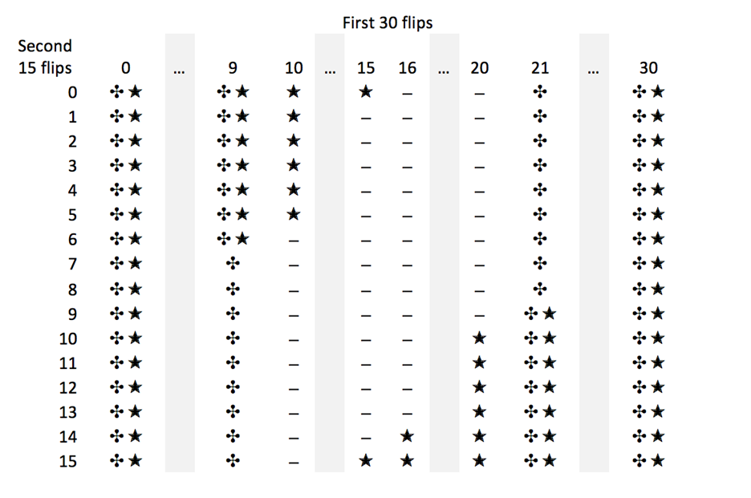

```{r setup, include=FALSE}
# Make sure to keep the default for normal processing.
default_output_hook <- knitr::knit_hooks$get("output")

# Output hooks handle normal R console output.
knitr::knit_hooks$set( output = function(x, options) {

  comment <- knitr::opts_current$get("comment")
  if( is.na(comment) ) comment <- ""
  can_null <- grepl( paste0( comment, "\\s*\\[\\d?\\]" ),
                     x, perl = TRUE)
  do_null <- isTRUE( knitr::opts_current$get("null_prefix") )
  if( can_null && do_null ) {
    # By default R print output aligns at the right brace.
    align_index <- regexpr( "\\]", x )[1] - 1
    # Two cases: start or newline
    re <- paste0( "^.{", align_index, "}\\]")
    rep <- comment
    x <- gsub( re, rep,  x )
    re <- paste0( "\\\n.{", align_index, "}\\]")
    rep <- paste0( "\n", comment )
    x <- gsub( re, rep,  x )
  }

  default_output_hook( x, options )

})

knitr::opts_template$set("kill_prefix"=list(comment=NA, null_prefix=TRUE))

knitr::opts_chunk$set(opts.label="kill_prefix")

library(knitr)
library(readr)
library(dplyr)
library(ggpubr)
library(data.table)
```

## My Learning Journey

*Over the last week, I participated in Biometry in the following ways:*

- I asked / answered **2** questions posed in class.

- I asked **3** questions in Slack.

- I answered **0** questions posed by other students on Slack.

- I came to Heather's office hours: **Yes**

- I came to Jose's office hours: **No**

- I met with Heather or Jose separately from office hours: **Yes**

*Anything not falling into one of the above categories?*  

> **No**

*On a scale of 1 (no knowledge) to 10 (complete expert), how would I rate my comfort with R programming after this week?* 

> **7**

*Any topics from last week that you are still confused about?*

> **...everything? The quiz psyched me out a bit.**

\newpage

## Problem Set

### Part I

*Listen to Planet Money's podcast Episode 677: The Experiment Experiment. http://www.npr.org/sections/money/2016/01/15/463237871/episode-677-the-experiment-experiment. List three take-home messages from the podcast.*

- The "file drawer" effect can explain why so many positive results are published, and why so many of those experiments are not reproducible. By relegating negative results to the file drawer, you are inadvertently removing relevant data from the overall body of scientific knowledge.

- Furthermore, if you are relegating negative results to the file drawer, students in the future will never know that those experiments were conducted. Then they'll go and try something that seems interesting without ever knowing that it had been done and was considered not valuable in the past. 

- Even with the best intentions, scientists can introduce bias into their own work by running an experiment a few extra times "just to make sure it's interesting." By changing the rules in the middle of the experiment, you are not increasing sample size to increase scientific rigor. Instead you are increasing the chances that your experiment will find a positive result by chance. 

\newpage 

### Part II

*Suppose an experimenter plans to collect data on a coin-flipping experiment based on a two-tier stopping criterion (assume the coin is a fair coin). The experimenter will collect an initial batch of data with N=30 and then do a null hypothesis significance test. If the result is not significant, then an additional 15 subjects' data will be collected, for a total of 45. Suppose the researcher intends to use the standard critical values for determining significance at both the N=30 and N=45 stages. Our goal is to determine the actual false alarm rate (the Type I error rate $\alpha$) for this two-stage procedure, and to ponder what the mere intention of doing a second phase implies for interpreting the first stage, even if data collection stops with the first stage.*

#### A
*For N=30, what are the lower ($z_{low}$) and upper ($z_{high}$) limits of the 95th percentile confidence interval for z (z=number of heads)*
$$
\begin{aligned}
p(z \leq z_{low} \vert N=30,\theta=0.5)&<0.025 \\
p(z \geq z_{high} \vert N=30,\theta=0.5)&<0.025
\end{aligned}
$$

*assuming a two-tailed Type I error rate of 0.05 or less?*

```{r a}
z30Low <- qbinom(p = 0.025,
                 size = 30,
                 prob = 0.5
                 )-1
# Subtract one because you want less but not equal to the critical value and these are
# discrete observations.

z30High <- qbinom(p = 0.975,
                  size = 30,
                  prob = 0.5
                  )+1
# Add one for the same reasoning as subtracting one from zLow
```

The 95 percent confidence interval is (`r paste(z30Low, ", ", z30High, sep = "")`).

#### B
*For N=45, what are the lower ($z_{low}$) and upper ($z_{high}$) limits of the 95th percentile confidence interval for z (z=number of heads)*
$$
\begin{aligned}
p(z\leq z_{low}\vert N=45,\theta=0.5)&<0.025 \\
p(z\geq z_{high}\vert N=45,\theta=0.5)&<0.025
\end{aligned}
$$

*assuming a two-tailed Type I error rate of 0.05 or less?*

```{r b}
z45Low <- qbinom(p = 0.025,
                 size = 45,
                 prob = 0.5
                 )-1 

z45High <- qbinom(p = 0.975,
                  size = 45,
                  prob = 0.5
                  )+1
```

The 95 percent confidence interval is (`r paste(z45Low, ", ", z45High, sep = "")`).

\newpage
*For the next part of the exercise, consider the table provided.*


*Each cell of the table corresponds to a certain outcome from the first 30 flips of a fair coin and a certain outcome from the second 15 flips of the same fair coin. A cell is marked by a dagger, $\maltese$, if it has a result for the first 30 flips that would reject the null hypothesis. A cell is marked by a star, $\bigstar$, if it has a result for the total of 45 flips that would reject the null hypothesis. For example, the cell with 10 heads from the first 30 flips and 1 head from the second 15 flips is marked with a $\bigstar$ because the total number of heads for that cell, 10+1=11, is less than 15 (which is z_low for N=45 [a hint for part B!]). That cell has no dagger, $\maltese$, because getting 10 heads in the first 30 flips is not extreme enough to reject the null. If neither the first 30 coin flips, nor the second 15 coin flips, would reject the null hypothesis of a fair coin, than the cell is marked with a dash -.*
 
#### C 
*Denote the number of heads in the first 30 flips as $z_{1}$, and the number of heads in the second 15 flips as $z_{2}$. Explain why it is true that the $z_{1}$,$z_{2}$ cell of the table has a joint probability equal to* `dbinom(z1,30,0.5)*dbinom(z2,15,0.5)`

The probability of obtaining $z_1$ heads in the first thirty flips is independent of obtaining $z_2$ heads in the following fifteen. Therefore, the probability of obtaining $z_1$ and $z_2$ heads in forty-five flips is the joint probability of obtaining $z_1$ and $z_2$ heads in the first thirty and second fifteen, respectively. $P(z_1 \cap z_2) = P(z_1)\times P(z_2)$

`dbinom(z1,30,0.5)` produces the sum at and before $z_1$ under the curve of the PDF of a discrete probability distribution that describes thirty independent trials, or the equivalent of the probability of obtaining $z_1$ heads, $P(z_1)$. Likewise, `dbinom(z2,15,0.5)` produces the sum at and before $z_2$ under the curve of the PDF of a discrete probability distribution that describes fifteen independent trials, or the equivalent of the probability of obtaining $z_2$ heads, $P(z_2)$. Therefore, the product of `dbinom(z1,30,0.5)*dbinom(z2,15,0.5)` is equivalent to $P(z_1 \cap z_2) = P(z_1)\times P(z_2)$.

#### D 
*What is the sum of the probabilities of all the cells that contain a $\maltese$ (whether or not it contains a $\bigstar$)? Explain how you got your answer!* 

```{r d}
probDagger <- 2*sum(dbinom(x = 0:z30Low,
                           size = 30,
                           prob = 0.5
                           )
                    )
```

`dbinom()` provides the probabilities of $z_1$ heads in thirty independent trials. The cells that contain a $\maltese$ on the lower end of thirty trials is defined as 0 through 9, as calculated as `z30Low` in Part A and shown in the table. Passing a vector to `dbinom()` will produce a vector of probabilities, so `sum(dinom())` will add the discrete probabilities from 0 to 9. Since that is the lower tail, you then multiply by two to get the two-tailed probability, or to include the equivalent of `dbinom(x = z30High:30, size = 30, prob = 0.05))`. 

Therefore, the sum of the probabilities of all cells that contain $\maltese$ is `r round(probDagger, digits = 3)`. 

#### E 
*What is the sum of the probabilities of all the cells that contain a $\bigstar$ (whether or not it contains a $\maltese$)? Explain how you got your answer!*

```{r e}
probStar <- 2*sum(dbinom(x = 0:z45Low,
                         size = 45,
                         prob = 0.5
                         )
                  )
```

This was calculated very similarly to Part D. `dbinom()` provides the probabilities of $z_2$ heads in forty-five independent trials. The cells that contain a $\bigstar$ on the lower end of forty-five trials is defined as 0 through 15, stored as `z45Low` in Part B and shown in the table. Passing a vector to `dbinom()` will produce a vector of probabilities, so `sum(dinom())` will add the discrete probabilities from 0 to 15. Since that is the lower tail, you then multiply by two to get the two-tailed probability, or to include the equivalent of `dbinom(x = z45High:45, size = 45, prob = 0.05))`. 

Therefore, the sum of the probabilities of all cells that contain $\bigstar$ is `r round(probStar, digits = 3)`. 

#### F 
*What is the sum of the probabilities of all the cells that contain either a $\maltese$ or a $\bigstar$? (Note: This is the Type I error rate for the two-stage design, because these are all the ways you would decide to reject the null even when it is true.) Explain how you got your answer!*


#### G 
*Suppose that the researcher intends to run an experiment using this two-stage stopping criterion. She collects the first 30 flips and finds 8 heads. She therefore rejects the null hypothesis and reports that p<0.05. Is that correct? Explain.*


#### H
*Whenever we run an experiment and get a result that trends away from the null experiment, but isn't quite significant, it's natural to consider collecting more data. We saw in the previous part that even intending to collect more data, but not actually doing it, inflates the Type I error rate. Doesn't the fact that we always consider collecting more data mean that we always have a much higher Type I error rate than we pretend we do? Doesn't the actual Type I error rate of an experiment depend on the maximal number of data points we'd be willing to collect over the course of our lifetimes? In 1-2 paragraphs, discuss this conundrum and decide whether or not you think this poses a fundamental problem with null hypothesis testing.* 


